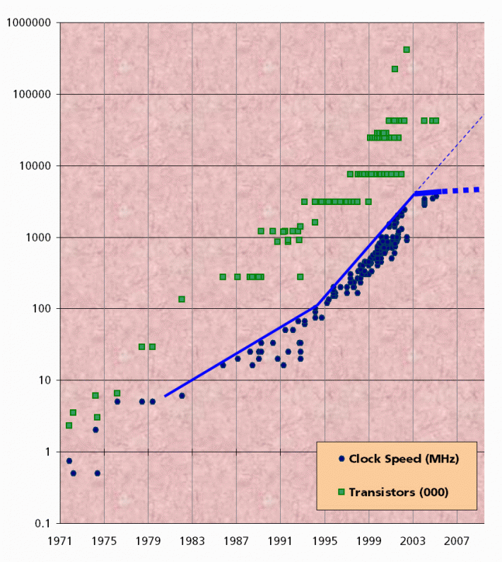

# Webが抱える問題😢

---
# テーマ

## Concurrency & Parallelism

---
## 目次
* 問題
    * C10K問題
    * リアルタイムWeb
    * ムーアの法則の限界
* 解決策
* 自作アプリデモ

---
# C10K問題
10000以上のクライアントがサーバに同時接続すると、HWの性能は足りていてもOS、ソフトウェアの問題で処理が破綻する😢

---
# C10K問題
node.jsでもc10kはクリアできたけど、言語特性上の問題として安定運用に向いてなかった😢
(シングルスレッドだと厳しい）

---
# リアルタイムWeb
サーバ、クライアントが常時接続するアプリケーションが増えてきて大変😢

---
# リアルタイムWeb
#### 例）

* チャット
* Googleのリアルタイム検索
* IoT

---
# ムーアの法則の限界
CPUチップメーカーの製造するチップのクロックレートの成長に陰り😢

代わりにマルチコアアーキテクチャのCPUが開発されている👍

---
# ムーアの法則の限界

---
# ムーアの法則の限界
CPU資源を最大限に活用するために並行性が必須😢

クラウド上で動くプログラムも分散・並行が基本であり、この流れは不可避😭

---
# 解決策
Elixirを使う

(あくまで解決策の１つです)

---
# Elixirの特徴
* 並行処理
* 信頼性
* ホットスワップ
* 高い生産性
