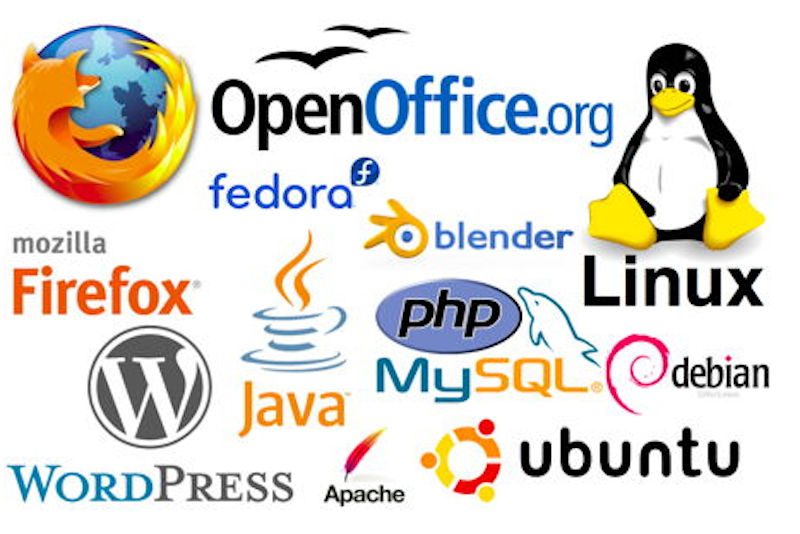

# How to contribute to OSS

---

# 自己紹介
* 石橋孝則
* 現在のプロジェクトRailsアプリケーション開発
  * Ruby
  * CoffeeScript
  * Java(たまに)

---
# 目的

---
# 対象

---

# アジェンダ
* OSSとは
* 今年貢献したOSS
  * servo
  * phoenix_slime
  * atom-circle-ci
* OSSプロジェクトに参加するメリット
* OSSプロジェクトに参加する方法
* 目標

---

# OSSとは
---
# 例えば

---

# 今年貢献したOSS
* servo
* phoenix_slime
* atom-circle-ci

---
# servo

---
# phoenix_slime

---
# atom-circle-ci
---
# OSSプロジェクトに参加するメリット
---

# OSSプロジェクトに参加する方法
---
